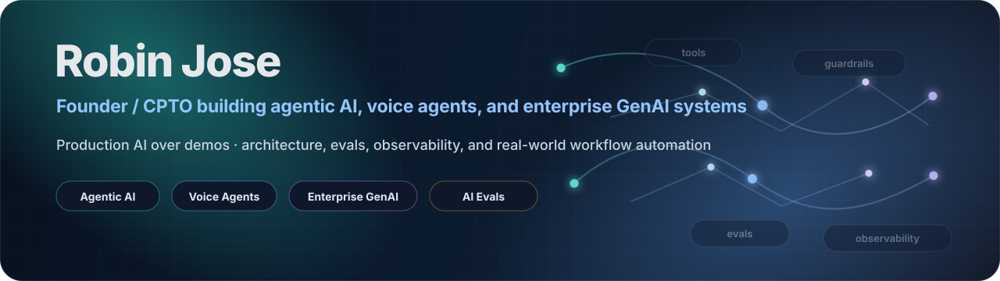

  

## Robin Jose

Founder / CPTO building applied AI products, agentic systems, and enterprise GenAI platforms.

I am currently building Nexora and Curaay, with a focus on voice agents, agentic workflows, healthcare booking, and production-grade AI systems. Also the Founder/CEO of AIGist24 - a boutique consulting company focused on building high impact AI solutions for enterprises.

Previously, I was Chief Data & Analytics Officer at Berlin-based unicorn wefox and have built and exited AI/data startups.

I am based in Berlin.

## Current focus

- Agentic AI systems for real-world business workflows
- Voice agents and outbound automation
- Healthcare AI and compliant data flows
- GenAI architecture, evaluation, observability, and deployment
- AI product strategy for enterprise adoption

## Technical areas

**Languages & frameworks**

  
  
  
  

**Data & infrastructure**

  
  
  
  
  
  
  

**AI & voice**

  
  
  
  
  

**AI agents & harnesses**

  
  
  
  
  

## Selected public work

Most of my active product work is in private repositories. I use this profile to share public reference projects, architecture notes, and implementation templates around AI and agentic systems.

### [Agentic Handbook](https://github.com/robinjose911/agentic-handbook)
A vendor-neutral playbook for shipping reliable AI agents in production: design patterns, anti-patterns, decision trees, and procurement-grade checklists, anchored by the AGENTIC mnemonic. Includes 5 runnable reference examples and an explicit EU AI Act lens.

### [Callplane](https://github.com/robinjose911/callplane)
A production-grade control plane for AI voice agents: LiveKit rooms, SIP telephony, provider failover, BullMQ reliability, cost metering, webhooks, and a self-service console. Runs in stub mode with zero API keys.

### [Loop Engineering Handbook](https://github.com/robinjose911/loop-engineering-handbook)
A guide to loop engineering, a copy-paste prompt library, and 7 worked examples that actually run — with the iteration logs, cost ledgers, and outputs (including work that isn't code).

### [LLM Router Demo](https://github.com/robinjose911/llm-router-demo)
Side-by-side benchmark of premium LLM calls vs cost-aware routing, with a live savings simulator from 1k to 10M requests/month. Makes LLM unit economics visible before they hit your P&L.

I'm gradually publishing more of these — next up is an AI agent evaluation template, with a healthcare AI data-flow template and an LLM observability starter after that.

## Companies (Currently Active)

- Nexora — agentic AI systems and voice automation: https://nexoraagents.com/
- Curaay — AI-assisted healthcare booking : https://curaay.com/
- AIGist24 — boutique GenAI consulting: https://www.aigist24.com/ 

## Elsewhere
- LinkedIn: https://www.linkedin.com/in/robinjose/
- X: https://x.com/Robin_Jose
